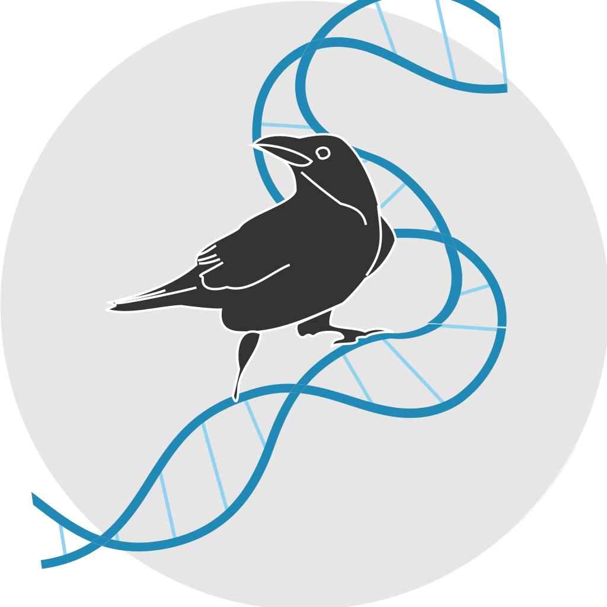

# Seiðr

Toolkit to create crowd networks

# Questions?

Talk to us on Gitter: 

# Build Status

* Master branch : 
* Devel branch : 

Please find the full documentation at [http://seidr.readthedocs.io/](http://seidr.readthedocs.io/)
