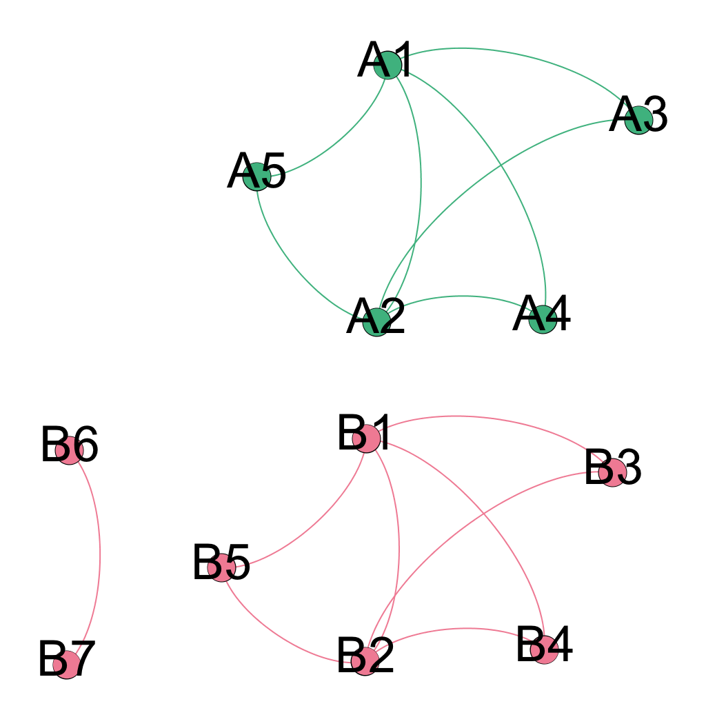
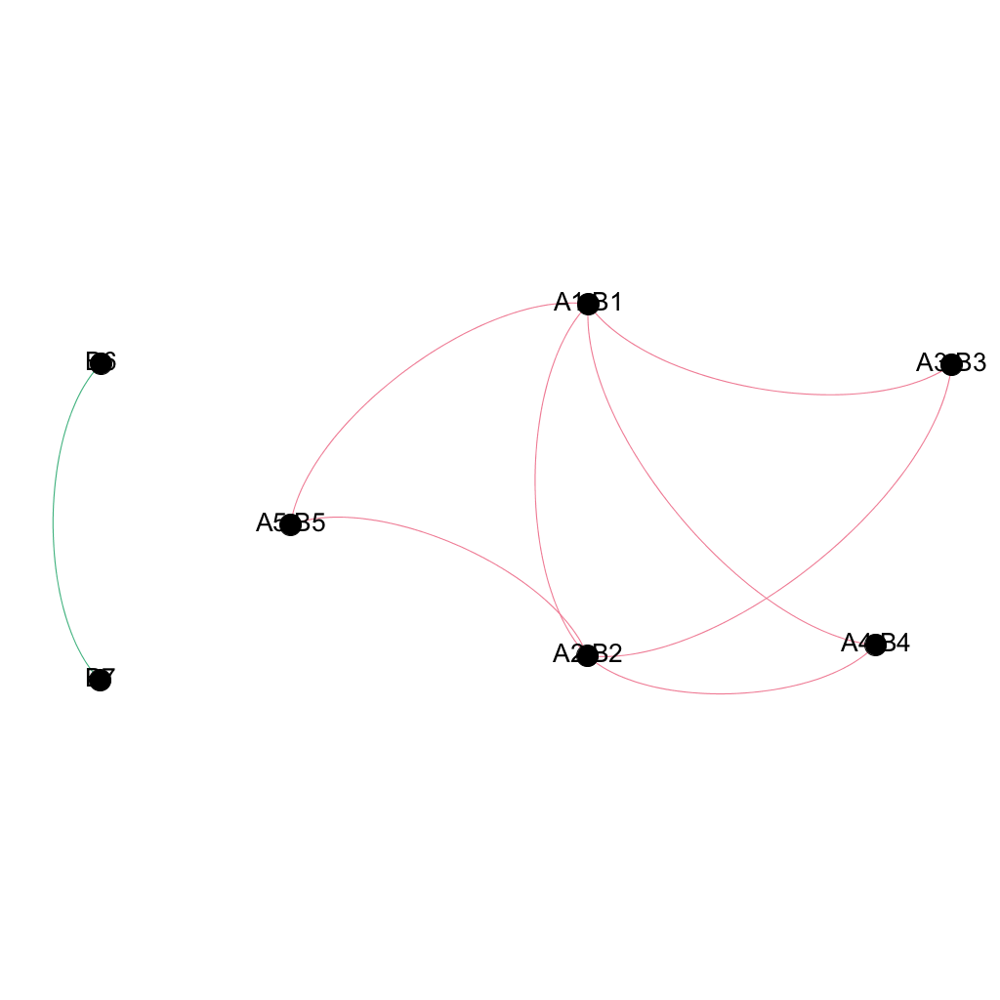

.. _compare-label:

Comparing networks of different species with ``seidr``
======================================================

Introduction
^^^^^^^^^^^^

Seidr can compare edges and nodes of two networks that originate from separate species **if the user supplies an onthology** to translate the node IDs from network A to network B. Consider the these two networks:

**net1.sf:**

+--------+--------+-------------+-------------+
| Source | Target | Type        | Weight;Rank |
+========+========+=============+=============+
| A1     |  A2    |  Directed   |7.82637e-06;7|
+--------+--------+-------------+-------------+
| A1     |  A3    |  Directed   |0.131538;5   |
+--------+--------+-------------+-------------+
| A2     |  A3    |  Directed   |  0.532767;2 |
+--------+--------+-------------+-------------+
| A1     |  A4    |  Directed   |  0.755605;1 |
+--------+--------+-------------+-------------+
| A2     |  A4    |  Directed   |  0.218959;4 |
+--------+--------+-------------+-------------+
| A1     |  A5    |  Directed   |  0.45865;3  |
+--------+--------+-------------+-------------+
| A2     |  A5    |  Directed   | 0.0470446;6 |
+--------+--------+-------------+-------------+

**net2.sf:**

+--------+--------+-----------+-----------------+
| Source | Target | Type      | Weight;Rank     |
+========+========+===========+=================+
|B1      | B2     |  Directed |  7.82637e-06;8  |
+--------+--------+-----------+-----------------+
|B1      | B3     |  Directed |  0.131538;6     |
+--------+--------+-----------+-----------------+
|B2      | B3     |  Directed |  0.532767;3     |
+--------+--------+-----------+-----------------+
|B1      | B4     |  Directed |  0.755605;1     |
+--------+--------+-----------+-----------------+
|B2      | B4     |  Directed |  0.218959;5     |
+--------+--------+-----------+-----------------+
|B1      | B5     |  Directed |  0.45865;4      |
+--------+--------+-----------+-----------------+
|B2      | B5     |  Directed |  0.0470446;7    |
+--------+--------+-----------+-----------------+
|B6      | B7     |  Directed |  0.678865;2     |
+--------+--------+-----------+-----------------+

Before we can overlap these two networks, we need to define which nodes are equivalent between them. The file format is a very simple TAB delimited dictionary, each line defining a translation from A to B::

    A1  B1
    A2  B2
    A3  B3
    A4  B4
    A5  B5

Important info
^^^^^^^^^^^^^^

* The compare function currently completely ignores directionality. All output will be undirected.
* There is no support for asymmetric translations. If A1 -> B1, but B1 -> A2 it is left to the user which translation to prioritize.
* Ranks will be merged via :math:`\sum A_{ij} B_{ij}` for overlapping edges where :math:`A_{ij}` is an edge in network A and :math:`B_{ij}` is an edge in network B
* Scores will be computed from all ranks in the dataset via :math:`\frac{x_i - min(x)}{max(x) - min(x)}` where :math:`x` is a vector of all ranks in the merged network and :math:`x_i` is the current rank for edge :math:`i`

Running ``seidr compare``
^^^^^^^^^^^^^^^^^^^^^^^^^

As a minimum, the user needs to provide the translation (``-t, --translate``) and two networks in the binary ``SeidrFile`` (see :ref:`seidrfile-label`) format. This will create a new file (by default "compare.sf") containing the merged network::

    seidr compare -t dict.txt net1.sf net2.sf

Output of ``seidr compare``
^^^^^^^^^^^^^^^^^^^^^^^^^^^

The output of ``seidr compare`` in its default mode is a merged network. Nodes with overlaps will be comma separated. If e.g. node A1 ine network A matches node B1 in network B, the joined new node will be "A1,B1". The fourth column of the merged network contains important metadata for the edges:

* _Flag_: The flag indicates whether the edge was found in both networks (0), only in the first network (1) or only in the second network (2).
* _Rank\_A_: This is the original rank of the edge in network A. If it was not present in network A, its rank will be 0.
* _Rank\_B_: Analogous to _Rank\_A_.

+--------+--------+------------+-------------+----------------------+
| Source | Target | Type       | Weight;Rank | Flag;Rank\_A;Rank\_B |
+========+========+============+=============+======================+
|A2,B2   |  A1,B1 | Undirected |  0;15       |  0;7;8               |
+--------+--------+------------+-------------+----------------------+
|A3,B3   |  A1,B1 | Undirected |  0.307692;1 | 0;5;6                |
+--------+--------+------------+-------------+----------------------+
|A3,B3   |  A2,B2 | Undirected |  0.769231;5 | 0;2;3                |
+--------+--------+------------+-------------+----------------------+
|A4,B4   |  A1,B1 | Undirected |  1;2        | 0;1;1                |
+--------+--------+------------+-------------+----------------------+
|A4,B4   |  A2,B2 | Undirected |  0.461538;9 | 0;4;5                |
+--------+--------+------------+-------------+----------------------+
|A5,B5   |  A1,B1 | Undirected |  0.615385;7 | 0;3;4                |
+--------+--------+------------+-------------+----------------------+
|A5,B5   |  A2,B2 | Undirected |  0.153846;13| 0;6;7                |
+--------+--------+------------+-------------+----------------------+
|B7      | B6     | Undirected |  1;2        | 2;0;2                |
+--------+--------+------------+-------------+----------------------+

Running ``seidr compare -n``
^^^^^^^^^^^^^^^^^^^^^^^^^^^^

If you are interested in nodes, rather than edges, you can run ``seidr compare`` with the ``-n`` option. This will create output describing whether a node had at least one edge in network A (1), network B (2) or both (0)::

    seidr compare -n -t dict.txt net1.sf net2.sf

Output of ``seidr compare -n``
^^^^^^^^^^^^^^^^^^^^^^^^^^^^^^

The output of ``seidr compare -n`` will be 2 columns as TAB delimited text written to ``stdout`` indicating whether a node had at least one edge in network A (1), network B (2) or both (0)::

    A1,B1 0
    A2,B2 0
    A3,B3 0
    A4,B4 0
    A5,B5 0
    B6  2
    B7  2

