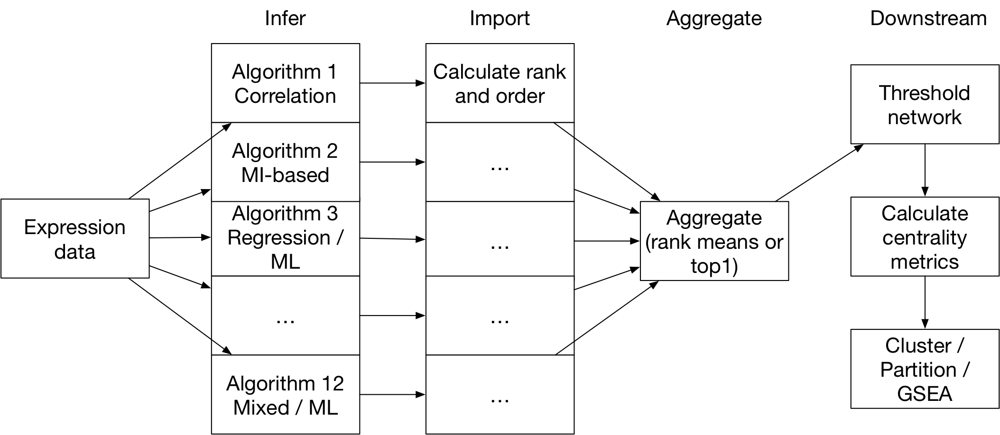

.. _intro-label:

The Crowd Network Idea
======================

``Seidr`` is a product of an idea presented in the DREAM 5 network challenge 
[Marbach2012]_. In it, the authors show that gene regulatory network 
inference algorithms tend to suffer from biases towards specific interaction patters. 
They suggested a way to get around this by creating an aggregate of all the 
methods used in the study: a crowd network.

While the paper is widely cited, there is little software that attempts to
integrate the findings. ``Seidr`` is an attempt to create a toolbox that 
simplifies the laborious effort of creating crowd networks.

The basic pipeline
^^^^^^^^^^^^^^^^^^

A typical run of ``seidr`` has three steps:

* Infer: In the inference step, independent gene-gene networks are created by a multitude of algorithms.
* Import: In order to merge these networks, they are first sorted and ranked. To achieve this ``seidr`` uses its own file format: SeidrFiles (see :ref:`seidrfile-label`).
* Aggregate: Once all methods are ready, ``seidr`` can aggregate them to a crowd network.

In principle, any network can be input into ``seidr``, as long as it was constructed
under similar assumptions as all other networks. For example, it would be a bad idea
to take a subset of genes and create a network, which is then aggregated with another
subset using *different* genes. ``Seidr`` provides a number of algorithms as native
applications written in C++:

+----------------------+--------------------------+--------------------------+------------------+---------------------------+----------------+----------------+
| Name                 | Published                | Type                     | Orig. Lang.      | Seidr Lang.               | Orig. Parallel | Seidr Parallel |
+======================+==========================+==========================+==================+===========================+================+================+
| ANOVERENCE           | [Kueffner2012]_          | ANOVA                    | C++              | C++                       | No             | No             |
+----------------------+--------------------------+--------------------------+------------------+---------------------------+----------------+----------------+
| ARACNE               | [Margolin2006]_          | MI + DPI                 | C++              | C++                       | Yes            | Yes            |
+----------------------+--------------------------+--------------------------+------------------+---------------------------+----------------+----------------+
| CLR                  | [Faith2007]_ [Daub2004]_ | MI + CLR                 | MATLAB / C / C++ | C++                       | No             | Yes            |
+----------------------+--------------------------+--------------------------+------------------+---------------------------+----------------+----------------+
| Elastic Net ensemble | [Ruyssinck2014]_         | Elastic Net Regression   | R (glmnet)       | C++ (glmnet)              | No             | Yes            |
+----------------------+--------------------------+--------------------------+------------------+---------------------------+----------------+----------------+
| GENIE3               | [Huynh-Thu2010]_         | Random Forest Regression | R (randomForest) | C++ (ranger)              | No             | Yes            |
+----------------------+--------------------------+--------------------------+------------------+---------------------------+----------------+----------------+
| NARROMI              | [Zhang2013]_             | MI + Linear Programming  | MATLAB           | C++ (glpk)                | No             | Yes            |
+----------------------+--------------------------+--------------------------+------------------+---------------------------+----------------+----------------+
| Partial Correlation  | [Schafer2005]_           | Correlation              | R                | C++                       | No             | No             |
+----------------------+--------------------------+--------------------------+------------------+---------------------------+----------------+----------------+
| Pearson Correlation  | NA                       | Correlation              | NA               | C++                       | No             | No             |
+----------------------+--------------------------+--------------------------+------------------+---------------------------+----------------+----------------+
| PLSNET               | [Guo2016]_               | PLS                      | MATLAB           | C++                       | No             | Yes            |
+----------------------+--------------------------+--------------------------+------------------+---------------------------+----------------+----------------+
| Spearman Correlation | NA                       | Correlation              | NA               | C++                       | No             | No             |
+----------------------+--------------------------+--------------------------+------------------+---------------------------+----------------+----------------+
| SVM ensemble         | [Ruyssinck2014]_         | SVM regression           | R (libsvm) / C   | C++ (libsvm or liblinear) | No             | Yes            |
+----------------------+--------------------------+--------------------------+------------------+---------------------------+----------------+----------------+
| TIGRESS              | [Haury2012]_             | LASSO Regression         | MATLAB / R       | C++ (glmnet)              | No             | Yes            |
+----------------------+--------------------------+--------------------------+------------------+---------------------------+----------------+----------------+

Downstream
^^^^^^^^^^

Once you have a network, you probably want to explore it. To that end we provide 
some utilities to investigate the networks and to prepare them for input into
other software.