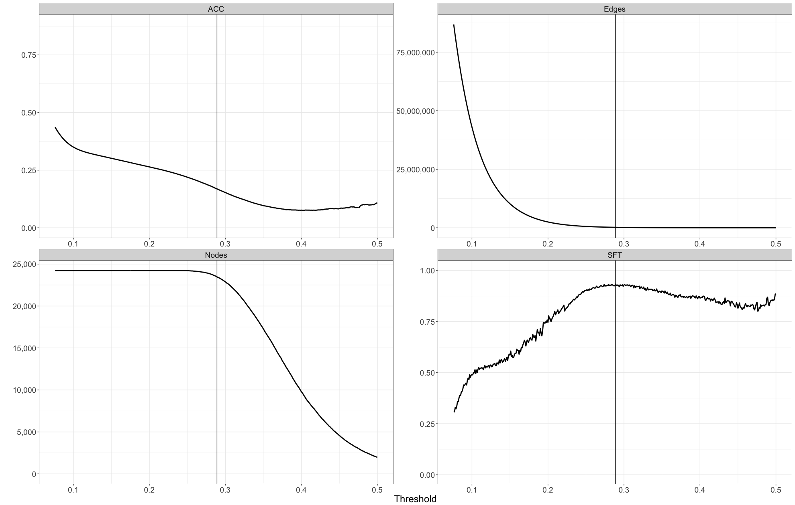

.. _threshold-label:

Estimating a hard threshold for a given seidr network
=====================================================

Post aggregation, if any network in the input dataset was fully dense (i.e. 
having a score for each possible link in the network) the aggregated network
will also be fully dense. The vast majority of the edges in the network will be
noise, therefore we would like to find a cutoff that represents most of the 
signal being kept, and most of the noise trimmed away.

Running ``seidr threshold``
^^^^^^^^^^^^^^^^^^^^^^^^^^^

The goal of ``seidr threshold`` is to provide a utility that assists in picking 
a hard cutoff. To that end it will iterate the network through a list of 
predefined thresholds and calculate:

* The number of edges
* The number of nodes
* The R^2 fit of the network to the `Scale Free Distribution <https://en.wikipedia.org/wiki/Scale-free_network>`_
* The `Average Clustering Coefficient <https://en.wikipedia.org/wiki/Clustering_coefficient#Network_average_clustering_coefficient>`_

It is left to the user to determine the final cutoff, based on expectation and
background knowledge of the network. 

In this example, we have already filtered the nodes of the network to strip away
those of low interest, our goal is therefore to maximize the number of nodes kept,
while keeping SFT and ACC high. At the indicated value, we keep 23470 nodes, 
191547 edges, with a SFT of 0.933 and an ACC of 0.169:

A note on "scale freeness"
^^^^^^^^^^^^^^^^^^^^^^^^^^

Using either scale freeness or average clustering coefficient to determine a hard
cut for a network is not without issues. Recent insights (e.g. [Broido2018]_ )
show that scale free networks are rare in real world networks and the criterion
should most definitely be applied with caution. A better approach would be to 
select nodes kept from a known "gold standard" or - if only the core interactions
are of interest - to perform "Network backboning" as described in e.g. [Coscia2017]_ .

Running ``seidr threshold``
^^^^^^^^^^^^^^^^^^^^^^^^^^^

``seidr threshold`` takes as a minimum a ``SeidrFile`` - usually, but not necessarily - 
from an aggregated network. By default it will create 1,000 evenly spaced thresholds
in range :math:`[0, 1]`. In practice, this tends to be wasteful of resources as
most high density thresholds tend to be not useful. There are several options
to adjust the range of thresholds to be tested:

* ``--min, -m``: Adjust the lowest threshold to be tested
* ``--max, -M``: Adjust the highest threshold to be tested
* ``--nsteps, -n``: Adjust the number of steps to be tested

By default, ``seidr threshold`` will check the *score* of the last column in the
``SeidrFile``, which can be adjusted with:

* ``--index, -i``: Adjust which score to use to determine the cutoff
* ``--threshold-rank, -r``: Determine a rank cutoff as opposed to a score

Be mindful that if you choose to threshold ranks, the meaning of minimum and
maximum change (in the rank, lower is better). And to adjust the ranges not to
test in rage :math:`[0, 1]`, but rather :math:`[1, N]`, where N is the highest
number of edges you would like to test.

Output
^^^^^^

``seidr threshold`` writes a tab separated table to stdout. The headers are:

* Threshold
* Number of nodes
* Number of edges
* Scale free fit (R^2)
* Average clustering coefficient

An example output looks like::

    0.842 5 5 0.80504672  0.375
    0.841 5 5 0.80504672  0.375
    0.84  5 5 0.80504672  0.375
    0.839 5 6 0.027420548 0.54545455
    0.838 5 6 0.027420548 0.54545455
    0.837 5 6 0.027420548 0.54545455
    0.836 5 6 0.027420548 0.54545455
    0.835 7 7 0.93935184  0.54545455
    0.834 7 7 0.93935184  0.54545455